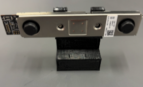
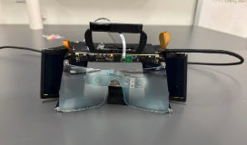
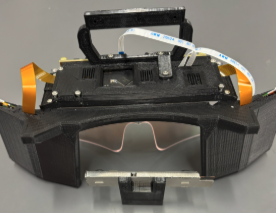
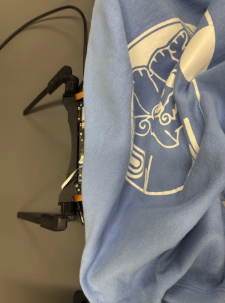
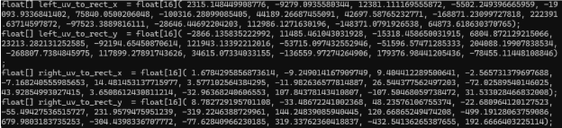
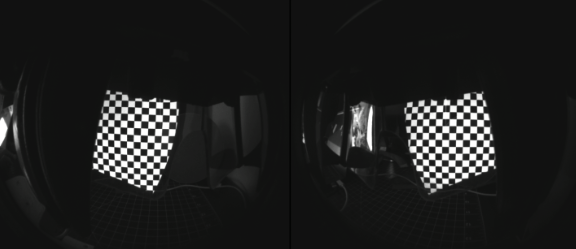
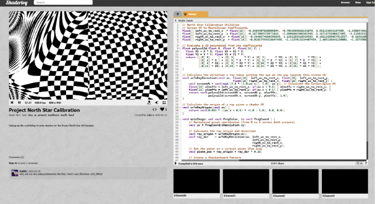
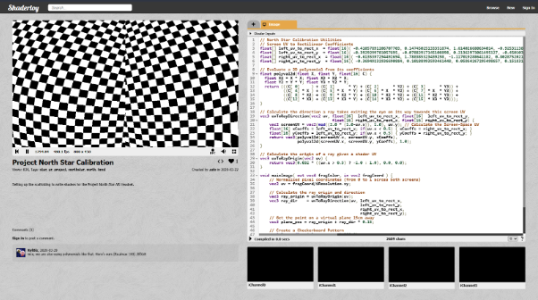

# Optics Calibration

- Use the T261_calibration_mount stl file to print out the calibration mount
- Screw the T261 camera on the calibration mount as below
  
  

- I set up the headset and the T261 camera, as seen below, to calibrate

   

- First, download the realsense-integration branch of the following repo: https://github.com/BryanChrisBrown/ProjectNorthStar/tree/realsense-integration, and you will get a ProjectNorthStar-realsense-integration file
- Setup python with the following dependencies: 
  - Pyrealsense2
  - opencv-contrib-python
  - numpy 

- In the ProjectNorthStar-realsense-integration file, go to Software → North Star Gen 2 → North Star Calibrator → captureGraycodes.py, then run the captureGraycodes.py 
- Make sure the T261 camera, which is screwed onto the mount, is looking through the headset where the users’ eyes will be
- On line 44 of captureGraycodes.py, you will want the X value (1920) to be your main monitor’s width in pixels (cv2.moveWindow (“Graycode Viewport”, 1920, 0))
- It also helps to place a piece of cloth over the headset to shield the cameras and headset from ambient light, as shown below

  

- Then run calibrateGraycodes.py in the ProjectNorthStar-realsense-integration file → Software → North Star Gen 2 → North Star Calibrator 
- From running that, you will get something like below

  

- Paste the above output into this website: https://www.shadertoy.com/view/wsscD4 called Shadertoy to check for alignment
- Also, make sure that the headset is plugged in and displaying imagery from your desktop
- Running calibrateGraycodes.py will display a sequence of gray codes on your North Star headset look something like below

  

- After pasting the output into the Shadertoy website and if you compile it, you will see something like this below  (black and white chess board)

  

- That blurry black and white chessboard represents a bad calibration result
- The following was my final calibration result

  

- Also note that dust on the display and lenses can affect calibration result

# (add pics)
